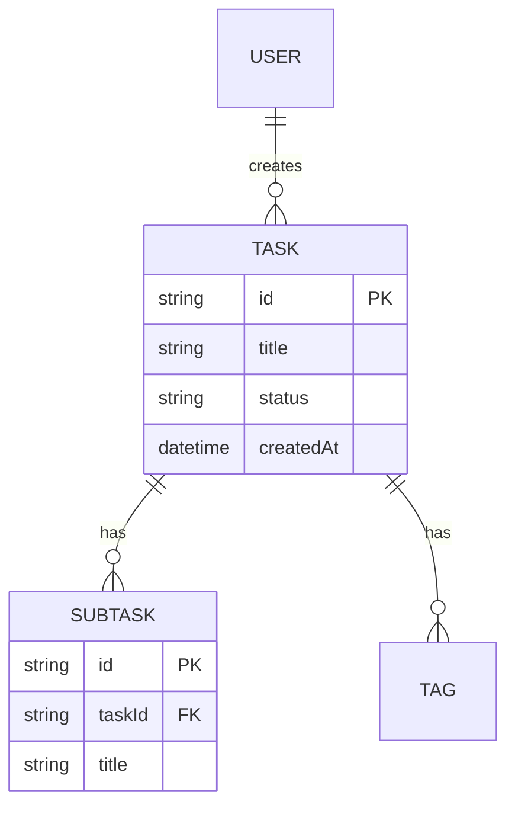

# 機能設計書作成ガイド

このガイドは、プロダクト要求定義書(PRD)に基づいて機能設計書を作成するための実践的な指針を提供します。

## 機能設計書の目的

機能設計書は、PRDで定義された「何を作るか」を「どう実現するか」に落とし込むドキュメントです。

### 主な内容

- システム構成図
- データモデル
- コンポーネント設計
- アルゴリズム設計（該当する場合）
- UI設計
- エラーハンドリング

## 作成の基本フロー

### ステップ1: PRDの確認

機能設計書を作成する前に、必ずPRDを確認します。

```text
Claude CodeにPRDから機能設計書を作成してもらう際のプロンプト例:

PRDの内容に基づいて機能設計書を作成してください。
特に優先度P0(MVP)の機能に焦点を当ててください。
```

### ステップ2: システム構成図の作成

システム構成図はMermaid記法で記述します。

### ステップ3: データモデル定義

データモデリングを行います。

**基本的なTask型の例**:

```markdown
| フィールド | 型 | 必須 | 説明 | 制約 |
|:---|:---|:---|:---|:---|
| id | string (UUID) | Yes | ユーザーID | UUID形式 |
| title | string | Yes | 表示名 | 最大50文字 |
| description | string | No | 詳細 | 最大200文字 |
| status | string | Yes | ステータス ('todo' | 'in_progress' | 'completed') | 固定値 |
| priority | string | Yes | 優先度 ('high' | 'medium' | 'low') | 固定値 |
| dueDate | datetime | No | 期限 | 日付形式 |
| createdAt | datetime | Yes | 作成日時 | 日付形式 |
| updatedAt | datetime | Yes | 更新日時 | 日付形式 |
```

**重要なポイント**:

- 制約（文字数、形式など）を明記

#### ER図の作成

複数のエンティティがある場合、mermaid形式のER図で関連を示します。



### ステップ4: ユースケース図

主要なユースケースをmermaid形式のシーケンス図で表現します。

### ステップ5: エラーハンドリング

エラーの種類と処理方法を定義します。

| エラー種別 | 処理 | ユーザーへの表示 |
|-----------|------|-----------------|
| 入力検証エラー | 処理を中断、エラーメッセージ表示 | "タイトルは1-200文字で入力してください" |
| ファイル読み込みエラー | 空の初期データで継続 | "データファイルが見つかりません。新規作成します" |
| タスクが見つからない | 処理を中断、エラーメッセージ表示 | "タスクが見つかりません (ID: xxx)" |

### ステップ6: UX設計（該当する場合）

`lofi-wireframer` スキルをロードし、excalidraw形式でワイヤーフレームを作成します。

## 機能設計書のレビュー

### レビュー観点

Claude Codeにレビューを依頼します:

```markdown
この機能設計書を評価してください。以下の観点で確認してください:

1. PRDの要件を満たしているか
2. データモデルは具体的か
3. コンポーネントの責務は明確か
4. アルゴリズムは実装可能なレベルまで詳細化されているか
5. エラーハンドリングは網羅されているか
```

### 改善の実施

Claude Codeの指摘に基づいて改善します。

## まとめ

機能設計書作成の成功のポイント:

1. **PRDとの整合性**: PRDで定義された要件を正確に反映
2. **Mermaid記法の活用**: 図表で視覚的に表現
3. **詳細なアルゴリズム設計**: 複雑なロジックは具体的に
4. **レイヤー分離**: 各コンポーネントの責務を明確に
5. **実装可能なレベル**: 開発者が迷わず実装できる詳細度
