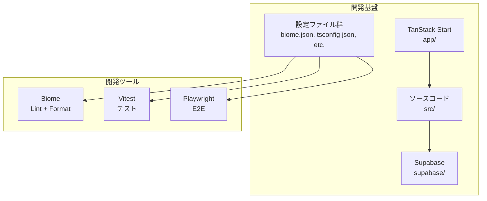

# 設計書

## アーキテクチャ概要

scaffold フェーズでは、`docs/architecture.md` で定義されたレイヤードアーキテクチャのディレクトリ構造と開発基盤を構築する。機能ロジックは含まず、フレームワーク・ライブラリの初期設定とプロジェクト構造の実体化に集中する。

## コンポーネント設計

### 1. TanStack Start エントリ (`app/`)

**責務**:

- TanStack Start のアプリケーションエントリポイント
- ファイルベースルーティングの骨格
- scaffold 段階では最小限のプレースホルダーページを配置

**実装の要点**:

- `app.config.ts` で TanStack Start の設定を定義
- `app/router.tsx` で TanStack Router + QueryClient を設定
- `app/client.tsx` でクライアントエントリを定義
- `app/ssr.tsx` でSSRエントリを定義
- `app/routes/__root.tsx` でルートレイアウトを定義（認証ガードは F1 で実装）
- `app/routes/index.tsx` でプレースホルダーのトップページを配置

**ファイル配置**:

- `app/routes/__root.tsx`
- `app/routes/index.tsx`
- `app/client.tsx`
- `app/router.tsx`
- `app/ssr.tsx`
- `app.config.ts`

### 2. Supabase ローカル環境 (`supabase/`)

**責務**:

- ローカル開発用の PostgreSQL 環境
- マイグレーションによるスキーマ管理
- DB型定義の自動生成

**実装の要点**:

- `supabase init` でプロジェクトを初期化
- 初期マイグレーションで posts, tags, post_tags テーブルを作成
- RLS ポリシーを全テーブルに設定（`docs/functional-design.md` に定義済み）
- インデックスを作成（`docs/functional-design.md` のインデックス定義に従う）
- `pg_trgm` 拡張を有効化（全文検索用）

**ファイル配置**:

- `supabase/config.toml`
- `supabase/migrations/20260215000000_init.sql`

### 3. Supabase クライアント (`src/lib/supabase/`)

**責務**:

- ブラウザ用・サーバー用の Supabase クライアント生成
- scaffold 段階ではクライアント生成のみ。セッション管理は F1 で実装

**実装の要点**:

- `client.ts`: `createBrowserClient` でブラウザ用クライアント生成
- `server.ts`: Server Functions 用クライアント生成のスケルトン（F1 で Cookie セッション対応を追加）

**ファイル配置**:

- `src/lib/supabase/client.ts`
- `src/lib/supabase/server.ts`

### 4. 共有モジュール (`src/lib/`, `src/types/`)

**責務**:

- アプリ全体の定数定義
- DB型定義（Supabase CLI で自動生成）
- 共通型定義のスケルトン

**実装の要点**:

- `constants.ts`: `MAX_POST_LENGTH = 280` 等のアプリ定数
- `database.ts`: `supabase gen types typescript` で生成（初回はマイグレーション適用後に生成）
- `common.ts`: `PaginatedResponse` 等の共通型のスケルトン

**ファイル配置**:

- `src/lib/constants.ts`
- `src/lib/utils.ts`
- `src/types/database.ts`
- `src/types/common.ts`

### 5. UIライブラリ設定

**責務**:

- Tailwind CSS v4 の初期設定
- shadcn/ui の初期化と基本コンポーネント追加

**実装の要点**:

- Tailwind CSS v4 は CSS ファイルでの `@import "tailwindcss"` で設定
- shadcn/ui の `components.json` を作成し、パスエイリアスを設定
- 最低限のコンポーネント（button, input, textarea）を追加

**ファイル配置**:

- `src/styles/globals.css`（Tailwind のエントリCSS）
- `components.json`
- `src/components/ui/button.tsx`
- `src/components/ui/input.tsx`
- `src/components/ui/textarea.tsx`

### 6. 開発ツール設定

**責務**:

- Biome: コードフォーマットとリント
- Vitest: ユニットテスト・統合テスト
- Playwright: E2Eテスト（設定のみ）

**実装の要点**:

- `biome.json`: `docs/development-guidelines.md` に定義された設定（タブ、セミコロンなし、ダブルクォート、100文字）
- `vitest.config.ts`: パスエイリアス、テスト対象パターン
- `playwright.config.ts`: ベースURL、ブラウザ設定

**ファイル配置**:

- `biome.json`
- `vitest.config.ts`
- `playwright.config.ts`

## データフロー

scaffold フェーズではデータフローは発生しない（機能ロジックを含まないため）。

## テスト方針

### ユニットテスト

- scaffold フェーズではビジネスロジックがないため、テスト対象は最小限
- Vitest が正しく動作することの検証として、`src/lib/constants.ts` のサンプルテストを1件作成

### 統合テスト

- scaffold フェーズでは対象なし

## セキュリティ考慮事項

- `.env.local` が `.gitignore` に含まれていること
- `SUPABASE_SERVICE_ROLE_KEY` がクライアント側に露出しないこと
- `.env.example` にはプレースホルダー値のみ記載し、実際のキーは含めない

## パフォーマンス考慮事項

- scaffold フェーズでは対象なし

## アクセシビリティ考慮事項

- shadcn/ui はデフォルトで Radix UI ベースのアクセシブルなコンポーネントを提供
- scaffold フェーズではコンポーネントの追加のみ。アクセシビリティのカスタマイズは機能実装時

## 将来の拡張性

- feature モジュール（`src/features/`）のディレクトリ構造を作成しておくことで、F1〜F6 の実装時にスムーズに着手できる
- Supabase の初期マイグレーションにテーブルとRLSを含めることで、機能実装時にDB周りの設定を再度行う必要がない

## 参照ドキュメント

- `docs/architecture.md` - アーキテクチャ設計書
- `docs/project-structure.md` - プロジェクト構造定義書
- `docs/development-guidelines.md` - 開発ガイドライン
- `docs/functional-design.md` - 機能設計書（DBスキーマ、RLS定義）
