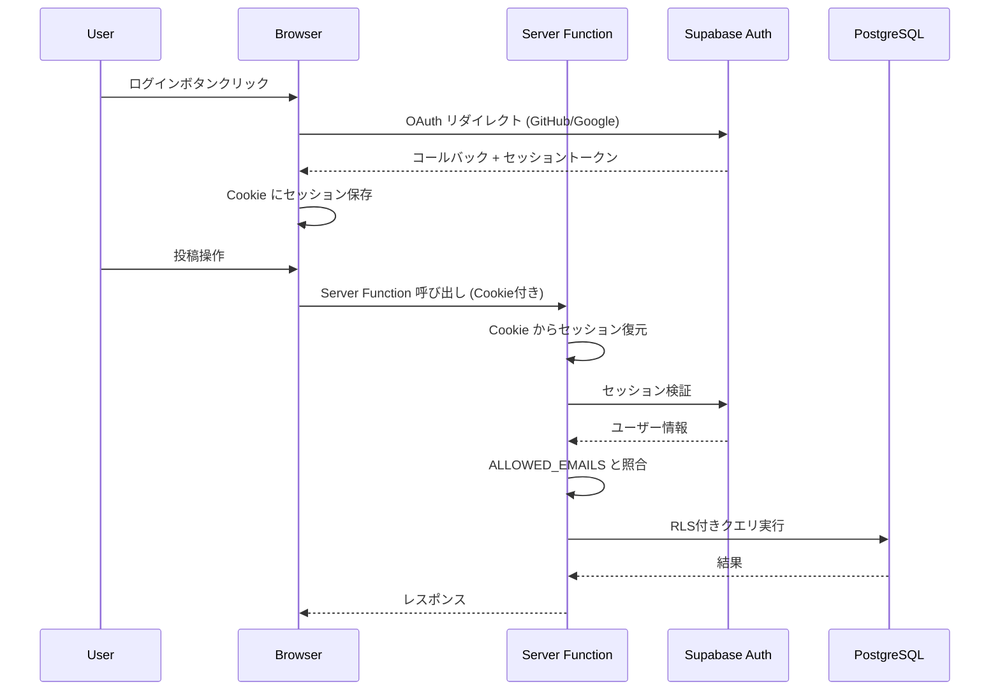

# 技術仕様書 (Architecture Design Document)

## テクノロジースタック

### 言語・ランタイム

| 技術 | バージョン |
|:---|:---|
| TypeScript | 5.x |
| Bun | 1.x |

- **TypeScript 5.x**: TanStack Start / Router が TypeScript ファーストで設計されており、フルタイプセーフな開発体験を得られる。ランタイムバリデーション（Zod）と組み合わせることで、コンパイル時と実行時の両方で型安全を担保する
- **Bun 1.x**: パッケージインストールの高速さ、TypeScriptネイティブ実行、テストランナー内蔵により開発効率が高い。Viteとの互換性も良好

### フレームワーク・ライブラリ

| 技術 | バージョン | 用途 | 選定理由 |
|:---|:---|:---|:---|
| TanStack Start | 1.x (RC) | フルスタックフレームワーク | 軽量ランタイム、Viteベース、Server Functions でサーバーサイドロジックを記述可能 |
| TanStack Router | 1.x | ルーティング | フルタイプセーフなルーティング。パス・パラメータ・検索パラメータを型レベルで検証 |
| TanStack Query | 5.x | データ取得・キャッシュ | 楽観的更新、無限スクロール、キャッシュ管理を宣言的に記述。Server Functions との統合が容易 |
| React | 19.x | UIライブラリ | TanStack Start のレンダリングエンジン |
| Tailwind CSS | 4.x | スタイリング | ユーティリティファースト。コンパクトUIの微調整が容易。v4はCSS-in-JSライクな記法に対応 |
| shadcn/ui | latest | UIコンポーネント | アクセシブル（Radix UI ベース）、コピー&ペースト方式で依存が軽い。カスタマイズ性が高い |
| Zod | 3.x | バリデーション | TanStack Start の Server Functions validator と統合。型推論によりスキーマから型を自動導出 |
| @supabase/supabase-js | 2.x | Supabase クライアント | 認証・DB操作の統合クライアント。RLSとの連携が容易 |
| @supabase/ssr | 0.x | SSRセッション管理 | サーバーサイドでの Cookie ベースセッション管理。TanStack Start の Server Functions 内で使用 |

### 開発ツール

| 技術 | バージョン | 用途 | 選定理由 |
|:---|:---|:---|:---|
| Vite | 6.x | ビルドツール | TanStack Start のデフォルトビルドツール。HMR が高速で開発体験が良い |
| Biome | 1.x | Linter + Formatter | ESLint + Prettier の統合代替。高速で設定がシンプル |
| Vitest | 3.x | テストランナー | Vite ネイティブで設定不要。Jest 互換API。コンポーネントテストにも対応 |
| Playwright | 1.x | E2Eテスト | クロスブラウザ対応。OAuth認証フローのテストが可能 |
| Supabase CLI | latest | ローカル開発環境 | ローカルでSupabaseを起動し、マイグレーション管理が可能 |

## アーキテクチャパターン

### レイヤードアーキテクチャ

```
┌─────────────────────────────────────────┐
│   UIレイヤー                              │ ← React コンポーネント
│   (PostComposer, Timeline, TagInput...)   │    ユーザー入力の受付と表示
├─────────────────────────────────────────┤
│   データアクセスレイヤー                    │ ← TanStack Query hooks
│   (useCreatePost, useListPosts...)        │    キャッシュ管理、楽観的更新
├─────────────────────────────────────────┤
│   サーバーレイヤー                         │ ← TanStack Start Server Functions
│   (createPost, listPosts...)              │    認証検証、バリデーション、DB操作
├─────────────────────────────────────────┤
│   データレイヤー                           │ ← Supabase (PostgreSQL + RLS)
│   (posts, tags, post_tags)                │    データ永続化、アクセス制御
└─────────────────────────────────────────┘
```

#### UIレイヤー
- **責務**: ユーザー入力の受付、クライアントサイドバリデーション（UX向上目的）、結果の表示
- **許可される操作**: データアクセスレイヤー（TanStack Query hooks）の呼び出し
- **禁止される操作**: Server Functions やSupabaseクライアントへの直接アクセス

#### データアクセスレイヤー
- **責務**: Server Functions の呼び出し、レスポンスのキャッシュ管理、楽観的更新
- **許可される操作**: Server Functions の呼び出し
- **禁止される操作**: Supabaseクライアントへの直接アクセス、UI ロジックの実装

#### サーバーレイヤー
- **責務**: セッション検証、Zodによる入力バリデーション、Supabaseを介したDB操作
- **許可される操作**: Supabaseクライアント経由でのデータ操作
- **禁止される操作**: UIレイヤーへの依存、レスポンスへの内部エラー詳細の露出

#### データレイヤー
- **責務**: データの永続化、RLSによるアクセス制御
- **許可される操作**: SQL操作（Supabaseクライアント経由）
- **禁止される操作**: ビジネスロジックの実装

### 依存関係の方向

```
UI → データアクセス → サーバー → データ (OK)
UI → サーバー (NG)
UI → データ (NG)
データアクセス → データ (NG)
```

## データ永続化戦略

### ストレージ方式

| データ種別 | ストレージ | 理由 |
|:---|:---|:---|
| 投稿・タグ | Supabase PostgreSQL | RLSによるアクセス制御、全文検索対応、マネージドバックアップ |
| セッション | Cookie (httpOnly) | Server Functions でのセッション検証に必要。@supabase/ssr が管理 |
| 環境設定 | 環境変数 | ALLOWED_EMAILS、Supabase接続情報などの機密情報 |

### バックアップ戦略

- **プラン**: Supabase Free プラン
- **自動バックアップ**: Free プランでは提供なし。手動で定期的に SQL ダンプをエクスポート
- **復元方法**: SQL ダンプからの復元
- **将来**: データ量の増加やバックアップの自動化が必要になった場合に Pro プランへの移行を検討

## パフォーマンス要件

### レスポンスタイム

| 操作 | 目標時間 | 測定方法 |
|:---|:---|:---|
| 初回ページ読み込み | 2秒以内 | Lighthouse Performance スコア |
| 投稿送信 → タイムライン反映 | 500ms以内（体感即時） | 楽観的更新により体感0ms、サーバー確定まで500ms |
| タイムライン追加読み込み | 300ms以内 | TanStack Query の fetchNextPage 完了まで |
| 検索結果表示 | 1秒以内 | 検索クエリ発行からレンダリング完了まで |
| タグフィルタ切り替え | 300ms以内 | フィルタパラメータ変更からレンダリング完了まで |

### リソース使用量

| リソース | 上限 | 理由 |
|:---|:---|:---|
| 初回JSバンドルサイズ | 150KB (gzip) | 小さいウィンドウで常時表示するため、軽量であること |
| Supabase DB | 500MB (Free プラン) | 280文字 x 10,000投稿 = 約3MB。タグ・インデックス含めても十分 |

## セキュリティアーキテクチャ

### 認証・認可フロー



### データ保護

- **通信暗号化**: HTTPS 必須（Supabase がデフォルトで提供）
- **アクセス制御**: Supabase RLS で DB レベルの行単位アクセス制御。全テーブルに `user_id = auth.uid()` ポリシー
- **機密情報管理**: 環境変数で管理。`.env.local` を `.gitignore` に追加

### 入力検証

- **バリデーション**: Zod スキーマによるサーバーサイド検証（Server Functions の validator）
- **サニタイゼーション**: React の自動エスケープに依存。`dangerouslySetInnerHTML` は使用禁止
- **エラーハンドリング**: エラーレスポンスにスタックトレースや内部情報を含めない

### 環境変数一覧

| 変数名 | 説明 | 公開範囲 |
|:---|:---|:---|
| `VITE_SUPABASE_URL` | Supabase プロジェクトURL | クライアント (VITE_ prefix) |
| `VITE_SUPABASE_ANON_KEY` | Supabase Anon Key | クライアント (VITE_ prefix) |
| `SUPABASE_SERVICE_ROLE_KEY` | Supabase Service Role Key | サーバーのみ |
| `ALLOWED_EMAILS` | ログイン許可メールアドレス（カンマ区切り） | サーバーのみ |

## スケーラビリティ設計

### データ増加への対応

- **想定データ量**: 10,000投稿（1日15投稿 x 2年分）
- **パフォーマンス劣化対策**:
  - カーソルベースページネーション（OFFSET を使用しない）
  - `(user_id, created_at DESC)` 複合インデックス
  - `pg_trgm` GINインデックスによる全文検索の高速化
- **アーカイブ戦略**: 個人利用のため当面不要。データ量が増加した場合はエクスポート機能（Post-MVP）で対応

### 機能拡張性

- **Server Functions の追加**: 新機能は新しい Server Function を追加する形で拡張。既存の関数に影響しない
- **UIコンポーネントの追加**: shadcn/ui のコンポーネントを追加コピーすることで拡張
- **Post-MVP 機能への対応**:
  - 画像添付: Supabase Storage を追加利用
  - Markdown対応: クライアントサイドのレンダリングライブラリを追加
  - エクスポート: 新しい Server Function として実装

## テスト戦略

### ユニットテスト

- **フレームワーク**: Vitest
- **対象**: Zod バリデーションスキーマ、Server Functions のビジネスロジック、ユーティリティ関数
- **カバレッジ目標**: 80%以上
- **モック**: Supabase クライアントをモック化。`vi.mock` で依存を差し替え

### 統合テスト

- **フレームワーク**: Vitest + Testing Library
- **対象**: UIコンポーネント + TanStack Query の統合動作
- **方法**: MSW (Mock Service Worker) で Server Functions のレスポンスをモック

### E2Eテスト

- **フレームワーク**: Playwright
- **対象**: 認証フロー、投稿 → タイムライン表示、タグフィルタ、検索
- **環境**: Supabase CLI のローカル環境に対して実行
- **シナリオ**:
  - ログイン → 投稿 → タイムライン確認 → ログアウト
  - 許可リスト外ユーザーのアクセス拒否
  - タグ付き投稿 → タグフィルタ → 結果確認

## 技術的制約

### 環境要件

- **ブラウザ**: Chrome / Firefox / Safari 最新2バージョン
- **ウィンドウ幅**: 360px 以上（コンパクトウィンドウ対応）
- **ネットワーク**: オンライン必須（オフライン対応はスコープ外）

### パフォーマンス制約

- Supabase Free プランの制限: 同時接続数、帯域幅、DB容量 (500MB)
- TanStack Start RC の安定性: マイナーバージョン間で API 変更の可能性

### セキュリティ制約

- Supabase Anon Key はクライアントに露出する（RLS で保護されるため許容）
- OAuth のリダイレクトURIをSupabase ダッシュボードで正確に設定する必要がある

## 依存関係管理

| ライブラリ | 用途 | バージョン管理方針 |
|:---|:---|:---|
| @tanstack/react-start | フレームワーク | 固定（RC のため破壊的変更リスク） |
| @tanstack/react-router | ルーティング | 固定（Start と合わせる） |
| @tanstack/react-query | データ取得 | ^（マイナーバージョンまで許可） |
| @supabase/supabase-js | DB/Auth クライアント | ^（マイナーバージョンまで許可） |
| @supabase/ssr | SSRセッション | ^（マイナーバージョンまで許可） |
| zod | バリデーション | ^（マイナーバージョンまで許可） |
| tailwindcss | スタイリング | ^（マイナーバージョンまで許可） |
| react | UIライブラリ | ^（マイナーバージョンまで許可） |

**方針**:
- TanStack Start / Router: RC のため完全固定。アップデートは手動で検証してから適用
- その他の安定版ライブラリ: `^` でマイナーバージョンまで自動許可
- `bun.lockb` をコミットし、CI/CD で再現可能なビルドを保証
