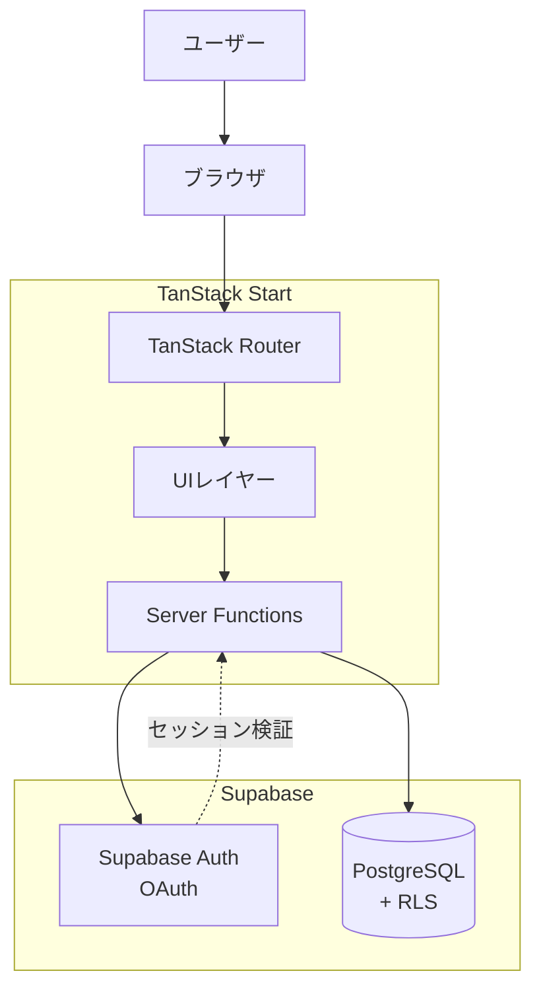
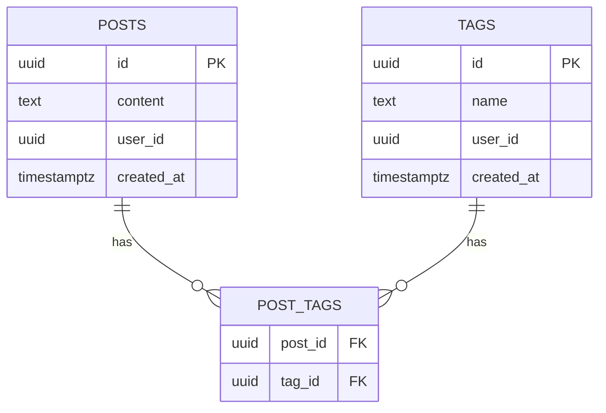
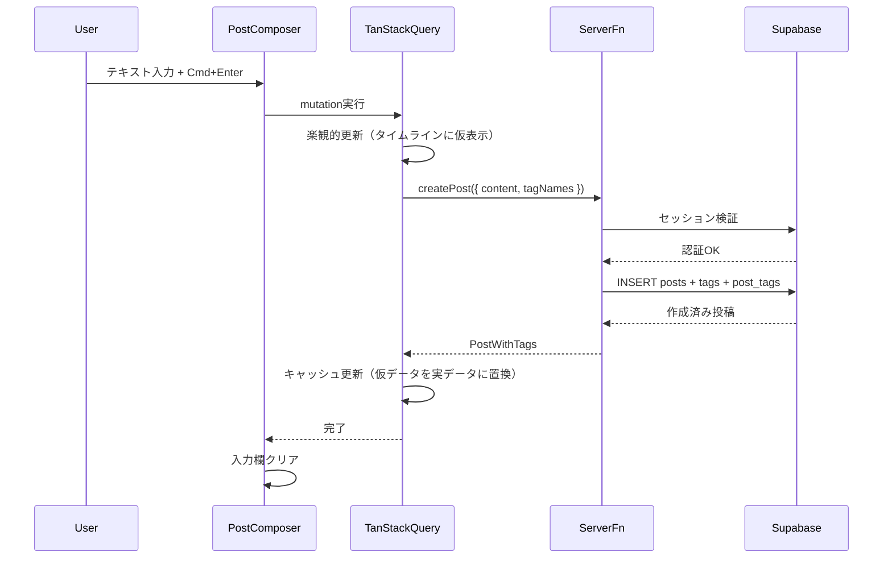
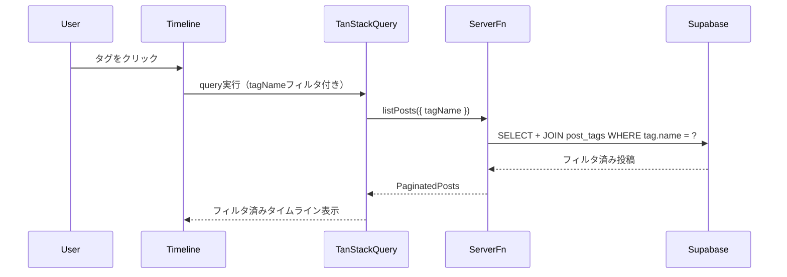
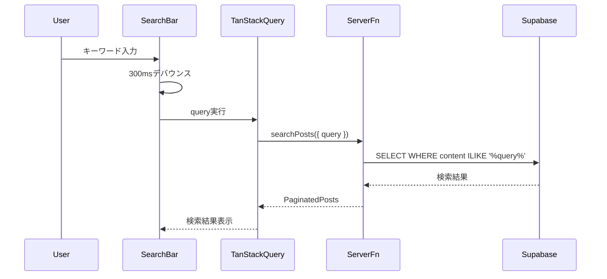
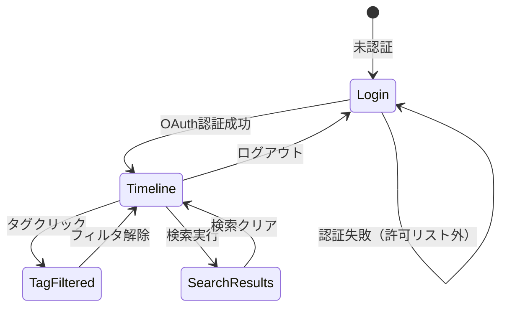

# 機能設計書 (Functional Design Document)

## システム構成図



## 技術スタック

| 分類 | 技術 | 選定理由 |
|:---|:---|:---|
| 言語 | TypeScript | 型安全。TanStack Startとの親和性が高い |
| フレームワーク | TanStack Start (RC) | 軽量、Viteベース、型安全ルーティング、opt-in SSR |
| ルーティング | TanStack Router | フルタイプセーフなルーティング |
| データ取得 | TanStack Query | キャッシュ管理、楽観的更新、無限スクロール |
| 認証 | Supabase Auth | OAuth対応、セッション管理、RLS連携 |
| DB | Supabase PostgreSQL | マネージドDB、RLS、全文検索 |
| ビルドツール | Vite | 高速な開発サーバー、HMR |
| スタイリング | Tailwind CSS v4 | ユーティリティファースト、コンパクトUI向き |
| UIコンポーネント | shadcn/ui | アクセシブル、カスタマイズ性が高い |
| バリデーション | Zod | ランタイムバリデーション、型推論 |

## データモデル定義

### エンティティ: Post（投稿）

| フィールド | 型 | 必須 | 説明 | 制約 |
|:---|:---|:---|:---|:---|
| id | string (UUID) | Yes | 投稿ID | UUID v4 |
| content | string | Yes | 投稿本文 | 1〜280文字 |
| userId | string (UUID) | Yes | 投稿者ID | Supabase Auth UID |
| createdAt | timestamptz | Yes | 作成日時 | DB自動設定 |

### エンティティ: Tag（タグ）

| フィールド | 型 | 必須 | 説明 | 制約 |
|:---|:---|:---|:---|:---|
| id | string (UUID) | Yes | タグID | UUID v4 |
| name | string | Yes | タグ名 | 1〜50文字、ユーザー内で一意 |
| userId | string (UUID) | Yes | 所有者ID | Supabase Auth UID |
| createdAt | timestamptz | Yes | 作成日時 | DB自動設定 |

### エンティティ: PostTag（投稿-タグ中間テーブル）

| フィールド | 型 | 必須 | 説明 | 制約 |
|:---|:---|:---|:---|:---|
| postId | string (UUID) | Yes | 投稿ID | FK → posts.id, ON DELETE CASCADE |
| tagId | string (UUID) | Yes | タグID | FK → tags.id, ON DELETE CASCADE |

**複合主キー**: (postId, tagId)

### ER図



### インデックス

| テーブル | カラム | 種別 | 目的 |
|:---|:---|:---|:---|
| posts | user_id, created_at DESC | B-tree | タイムライン取得の高速化 |
| tags | user_id, name | UNIQUE | タグ名の一意制約 |
| posts | content | GIN (pg_trgm) | 日本語を含む全文検索 |

### Row Level Security (RLS)

全テーブルにRLSを有効化し、以下のポリシーを適用:

```sql
-- posts: 自分の投稿のみ操作可能
CREATE POLICY "posts_select" ON posts FOR SELECT USING (auth.uid() = user_id);
CREATE POLICY "posts_insert" ON posts FOR INSERT WITH CHECK (auth.uid() = user_id);
CREATE POLICY "posts_delete" ON posts FOR DELETE USING (auth.uid() = user_id);

-- tags: 自分のタグのみ操作可能
CREATE POLICY "tags_select" ON tags FOR SELECT USING (auth.uid() = user_id);
CREATE POLICY "tags_insert" ON tags FOR INSERT WITH CHECK (auth.uid() = user_id);

-- post_tags: 自分の投稿に紐づくもののみ操作可能
CREATE POLICY "post_tags_select" ON post_tags FOR SELECT
  USING (EXISTS (SELECT 1 FROM posts WHERE posts.id = post_tags.post_id AND posts.user_id = auth.uid()));
CREATE POLICY "post_tags_insert" ON post_tags FOR INSERT
  WITH CHECK (EXISTS (SELECT 1 FROM posts WHERE posts.id = post_tags.post_id AND posts.user_id = auth.uid()));
CREATE POLICY "post_tags_delete" ON post_tags FOR DELETE
  USING (EXISTS (SELECT 1 FROM posts WHERE posts.id = post_tags.post_id AND posts.user_id = auth.uid()));
```

### 許可リスト方式の実装

Supabaseのカスタムクレームまたは環境変数で許可メールアドレスを管理:

```sql
-- auth hook: ログイン時に許可リストをチェック
CREATE OR REPLACE FUNCTION check_allowed_user()
RETURNS trigger AS $$
BEGIN
  IF NEW.email NOT IN (SELECT email FROM allowed_users) THEN
    RAISE EXCEPTION 'Unauthorized user';
  END IF;
  RETURN NEW;
END;
$$ LANGUAGE plpgsql;
```

代替案として、アプリケーション側のミドルウェアで `ALLOWED_EMAILS` 環境変数と照合する方式も可。MVP ではアプリケーション側での照合を採用し、シンプルに保つ。

## コンポーネント設計

### UIレイヤー

#### PostComposer（投稿フォーム）

**責務**:
- テキスト入力の受け付け
- タグの選択・新規作成
- Cmd/Ctrl+Enter での投稿送信
- 文字数カウント表示
- 楽観的更新によるタイムラインへの即時反映

**インターフェース**:
```typescript
type PostComposerProps = {
  readonly onPostCreated: () => void
}
```

#### Timeline（タイムライン）

**責務**:
- 投稿の時系列一覧表示
- 無限スクロールによる追加読み込み
- タグフィルタリング
- 投稿の削除操作

**インターフェース**:
```typescript
type TimelineProps = {
  readonly filterTag?: string
  readonly searchQuery?: string
}
```

#### TagInput（タグ入力）

**責務**:
- 既存タグのオートコンプリート
- 新規タグの作成
- 複数タグの選択・解除

**インターフェース**:
```typescript
type TagInputProps = {
  readonly selectedTags: readonly string[]
  readonly onTagsChange: (tags: readonly string[]) => void
}
```

#### SearchBar（検索バー）

**責務**:
- 検索キーワードの入力
- デバウンス付き検索実行
- 検索状態の表示

**インターフェース**:
```typescript
type SearchBarProps = {
  readonly onSearch: (query: string) => void
}
```

#### PostCard（投稿カード）

**責務**:
- 単一投稿の表示（本文、タグ、日時）
- 削除ボタンの表示
- タグクリックによるフィルタリング

**インターフェース**:
```typescript
type PostCardProps = {
  readonly post: Post & { readonly tags: readonly Tag[] }
  readonly onDelete: (postId: string) => void
  readonly onTagClick: (tagName: string) => void
}
```

### Server Functions（サーバー関数）

TanStack Start の `createServerFn` を使用し、サーバーサイドでSupabaseと通信する。

#### createPost

```typescript
const createPost = createServerFn({ method: "POST" })
  .validator(createPostSchema)
  .handler(async ({ data }): Promise<PostWithTags> => {
    // 1. セッション検証
    // 2. 投稿をpostsテーブルにinsert
    // 3. タグが指定されていれば、存在しないタグを作成
    // 4. post_tagsにrelationをinsert
    // 5. 作成された投稿（タグ付き）を返却
  })
```

#### listPosts

```typescript
const listPosts = createServerFn({ method: "GET" })
  .validator(listPostsSchema)
  .handler(async ({ data }): Promise<PaginatedPosts> => {
    // 1. セッション検証
    // 2. postsをcreated_at DESCで取得（カーソルベースページネーション）
    // 3. タグフィルタがあればpost_tagsでJOIN+フィルタ
    // 4. 各投稿に紐づくタグを取得
    // 5. ページネーション情報と共に返却
  })
```

#### searchPosts

```typescript
const searchPosts = createServerFn({ method: "GET" })
  .validator(searchPostsSchema)
  .handler(async ({ data }): Promise<PaginatedPosts> => {
    // 1. セッション検証
    // 2. pg_trgmのLIKE検索（日本語対応）
    // 3. 結果を日時順で返却
  })
```

#### deletePost

```typescript
const deletePost = createServerFn({ method: "POST" })
  .validator(deletePostSchema)
  .handler(async ({ data }): Promise<void> => {
    // 1. セッション検証
    // 2. postsテーブルから削除（RLSで所有者チェック）
    // 3. post_tags, tagsは CASCADE / 未使用タグの自動削除は行わない
  })
```

#### listTags

```typescript
const listTags = createServerFn({ method: "GET" })
  .handler(async (): Promise<readonly Tag[]> => {
    // 1. セッション検証
    // 2. 自分のタグを名前順で全件取得
  })
```

## バリデーションスキーマ

```typescript
const createPostSchema = z.object({
  content: z.string().min(1).max(280),
  tagNames: z.array(z.string().min(1).max(50)).max(10).default([]),
})

const listPostsSchema = z.object({
  cursor: z.string().uuid().optional(),
  limit: z.number().int().min(1).max(50).default(20),
  tagName: z.string().optional(),
})

const searchPostsSchema = z.object({
  query: z.string().min(1).max(100),
  cursor: z.string().uuid().optional(),
  limit: z.number().int().min(1).max(50).default(20),
})

const deletePostSchema = z.object({
  postId: z.string().uuid(),
})
```

## ユースケース図

### UC1: テキスト投稿



**フロー説明**:
1. ユーザーがテキストを入力し、Cmd+Enterで投稿
2. TanStack Queryが楽観的更新でタイムラインに即時反映
3. Server FunctionがSupabaseにデータを保存
4. 成功時、仮データを実データに置換。失敗時、仮データを除去しエラー表示

### UC2: タグフィルタリング



### UC3: 全文検索



## 画面遷移図



### 画面一覧

| 画面 | パス | 説明 |
|:---|:---|:---|
| ログイン | `/login` | OAuthプロバイダ選択画面 |
| タイムライン | `/` | メイン画面。投稿フォーム + タイムライン |
| タグフィルタ | `/?tag=xxx` | 特定タグで絞り込んだタイムライン |
| 検索結果 | `/?q=xxx` | 検索結果表示 |

タグフィルタと検索はクエリパラメータで制御し、画面遷移ではなくタイムラインの表示内容を切り替える。

## UI設計

### レイアウト（コンパクトモード: 360px幅）

```
+----------------------------------+
|  Echo               [検索] [▼]  |
+----------------------------------+
|  ┌──────────────────────────┐   |
|  │ 今なにしてる？            │   |
|  │                          │   |
|  │         [タグ+] 32/280 ⏎ │   |
|  └──────────────────────────┘   |
+----------------------------------+
|  作業ログ: APIの設計で悩んでる    |
|  #設計 #API         14:32       |
|  ─────────────────────────────  |
|  RESTよりGraphQLの方がいいかも    |
|  #設計                14:28     |
|  ─────────────────────────────  |
|  ランチ後、集中力が戻ってきた     |
|                       13:05     |
|  ─────────────────────────────  |
|           ...                   |
+----------------------------------+
```

**設計方針**:
- 投稿フォームは常に画面上部に固定表示
- タイムラインは下方向にスクロール
- タグは投稿本文の下にインラインで表示
- 時刻は相対時刻ではなく24時間形式（分報用途のため）
- 同日の投稿は日付を省略し、時刻のみ表示
- 日付が変わる境界にセパレータを表示

### カラーコーディング

| 要素 | 色の用途 |
|:---|:---|
| タグ | 控えめなバッジ。背景色はニュートラルグレー |
| 投稿フォーム | 視覚的に目立つ領域（薄いボーダーで囲む） |
| 時刻 | テキストより薄い色（セカンダリテキスト） |

### キーボードショートカット

| ショートカット | 動作 |
|:---|:---|
| Cmd/Ctrl + Enter | 投稿送信 |
| Cmd/Ctrl + K | 検索バーにフォーカス |
| Escape | 検索・フィルタを解除 |

## パフォーマンス最適化

- **楽観的更新**: 投稿送信時、サーバー応答を待たずにUIに即時反映。TanStack Queryの `onMutate` で実現
- **カーソルベースページネーション**: OFFSET方式ではなく `created_at` + `id` のカーソルで高速にページ送り
- **デバウンス検索**: 検索入力を300msデバウンスし、不要なリクエストを抑制
- **タグキャッシュ**: タグ一覧をTanStack Queryでキャッシュし、オートコンプリートの都度リクエストしない（staleTime: 5分）

## セキュリティ考慮事項

- **認証必須**: 全Server FunctionでSupabaseセッションを検証。未認証リクエストは401で拒否
- **許可リスト**: 環境変数 `ALLOWED_EMAILS` でログイン可能なメールアドレスを制限。OAuth認証成功後にサーバー側で照合
- **RLS**: 全テーブルでRow Level Securityを有効化。DBレベルで他ユーザーのデータアクセスを防止
- **入力バリデーション**: Zodスキーマで全入力をサーバー側で検証。クライアント側バリデーションはUX向上目的のみ
- **XSS対策**: Reactの自動エスケープに依存。`dangerouslySetInnerHTML` は使用しない

## エラーハンドリング

### エラーの分類

| エラー種別 | 処理 | ユーザーへの表示 |
|:---|:---|:---|
| 認証エラー (401) | ログイン画面にリダイレクト | 「セッションが切れました。再ログインしてください」 |
| 許可リスト外 (403) | ログイン画面に戻す | 「このアカウントではアクセスできません」 |
| バリデーションエラー (400) | 該当フィールドにエラー表示 | 「投稿は280文字以内で入力してください」 |
| ネットワークエラー | 楽観的更新をロールバック、リトライ促す | 「投稿の送信に失敗しました。再試行してください」 |
| サーバーエラー (500) | エラートーストを表示 | 「問題が発生しました。しばらくしてから再試行してください」 |

### ネットワークエラー時の投稿保持

楽観的更新が失敗した場合:
1. タイムラインから仮投稿を除去
2. 投稿フォームに入力内容を復元
3. エラートーストを表示

## テスト戦略

### ユニットテスト

- バリデーションスキーマ（Zod）の境界値テスト
- Server Functionのビジネスロジック（Supabaseクライアントをモック）
- UIコンポーネントの表示・インタラクション

### 統合テスト

- 投稿作成 → タイムライン表示の一連のフロー
- タグ作成 → 投稿紐づけ → フィルタリング
- 検索キーワード → 結果表示

### E2Eテスト

- OAuth認証 → 投稿 → タイムライン確認
- 許可リスト外ユーザーのアクセス拒否
- 無限スクロールの動作
