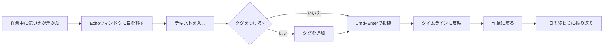

# プロダクト要求定義書 (Product Requirements Document)

## プロダクト概要

### 名称

**Echo** - 自分だけの非公開マイクロブログ

### プロダクトコンセプト

- **パーソナル分報**: Slackの分報文化を個人に最適化。仕事中の思考・進捗・気づきを自分だけの場所に流す
- **常駐コンパニオン**: デスクトップの隅に小さなウィンドウで常時表示。作業の邪魔をせず、いつでも書ける
- **ゼロソーシャル**: フォロー、いいね、拡散などのSNS要素を一切排除。他者の目を気にせず書ける

### プロダクトビジョン

Echoは「仕事中の思考を、自分のためだけに記録する」ためのマイクロブログである。Slackの分報のように、作業中の気づき・進捗・メモを気軽に書き留められる。ただしソーシャル要素は一切なく、読み手は未来の自分だけ。デスクトップの片隅に常時表示される小さなウィンドウで、作業を中断することなく思考を記録し、タグと検索で後から振り返る。

### 目的

- 仕事中の思考・気づき・進捗を、作業を中断せずに記録できるようにする
- SNSのソーシャルプレッシャーから解放された個人専用の分報空間を提供する
- タグと検索を通じて過去の思考を振り返り可能にする

## ターゲットユーザー

### プライマリーペルソナ: Daigo（30代、ソフトウェアエンジニア）

- 日常的にSlackの分報チャンネルで作業ログやつぶやきを書いている
- 分報は便利だが、チームのSlackに書くと他者の目が気になり、書く内容をフィルタリングしてしまう
- 仕事中にふと浮かんだ考えや気づきを、検閲なしで書き留めたい
- デスクトップの隅にウィンドウを小さくして常時開いておき、サッと書いてサッと戻りたい

## 成功指標(KPI)

### プライマリーKPI

- 平日の投稿数: 平均3件以上/日（仕事中の分報として定着）（利用開始1ヶ月後）
- 投稿完了時間: テキスト入力開始から投稿完了まで5秒以内（初回リリース時点）

### セカンダリーKPI

- 平日のアクセス日数: 週4日以上（利用開始1ヶ月後）
- タグ利用率: 投稿の50%以上にタグが付与されている（利用開始3ヶ月後）

## 機能要件

### コア機能(MVP)

#### F1: OAuth認証

**ユーザーストーリー**:
自分として、自分だけがアクセスできる環境を確保するために、OAuthでログインしたい

**受け入れ条件**:

- [ ] GitHub OAuthでログインできる
- [ ] Google OAuthでログインできる
- [ ] 未認証ユーザーはログイン画面にリダイレクトされる
- [ ] 許可された自分のアカウントのみがログインできる（不特定多数は登録不可）
- [ ] ログアウトできる

**優先度**: P0（必須）

#### F2: テキスト投稿

**ユーザーストーリー**:
自分として、思いついたことをすぐに記録するために、短文テキストを投稿したい

**受け入れ条件**:

- [ ] テキストを入力して投稿できる
- [ ] 投稿文字数の上限は280文字とする
- [ ] 空文字での投稿はできない
- [ ] 投稿後、タイムラインに即座に反映される
- [ ] Ctrl+Enter（またはCmd+Enter）のキーボードショートカットで投稿できる

**優先度**: P0（必須）

#### F3: タイムライン表示

**ユーザーストーリー**:
自分として、過去の投稿を振り返るために、投稿を時系列で一覧表示したい

**受け入れ条件**:

- [ ] 投稿が新しい順に一覧表示される
- [ ] 各投稿に投稿日時が表示される
- [ ] 無限スクロールまたはページネーションで過去の投稿を遡れる
- [ ] 投稿にタグが付与されている場合、タグが表示される

**優先度**: P0（必須）

#### F4: タグ機能

**ユーザーストーリー**:
自分として、投稿を分類・整理するために、投稿にタグを付けたい

**受け入れ条件**:

- [ ] 投稿時にタグを付与できる（0個以上、複数可）
- [ ] 既存のタグから選択できる（オートコンプリート）
- [ ] 新しいタグを自由に作成できる
- [ ] タグをクリックすると、そのタグが付いた投稿一覧にフィルタリングされる

**優先度**: P0（必須）

#### F5: 投稿の削除

**ユーザーストーリー**:
自分として、不要な投稿を整理するために、投稿を削除したい

**受け入れ条件**:

- [ ] 投稿を削除できる
- [ ] 削除前に確認ダイアログが表示される
- [ ] 削除後、タイムラインから即座に消える

**優先度**: P1（重要）

#### F6: 検索

**ユーザーストーリー**:
自分として、過去の投稿を探すために、キーワードで全文検索したい

**受け入れ条件**:

- [ ] キーワードを入力して投稿を全文検索できる
- [ ] 検索結果は関連度または日時順で表示される
- [ ] 検索中にローディング状態が表示される

**優先度**: P1（重要）

### 将来的な機能(Post-MVP)

#### F7: 投稿の編集

投稿内容を後から修正できる。

**優先度**: P2（できれば）

#### F8: 画像添付

投稿にスクリーンショットや写真を添付できる。

**優先度**: P2（できれば）

#### F9: Markdown対応

投稿本文をMarkdown形式で記述し、リッチに表示する。

**優先度**: P2（できれば）

#### F10: エクスポート

投稿データをJSON/Markdown形式でエクスポートできる。

**優先度**: P2（できれば）

## 非機能要件

### パフォーマンス

- 初回ページ読み込み: 2秒以内（3G回線を除く）
- 投稿送信からタイムライン反映: 500ms以内
- タイムラインの追加読み込み: 300ms以内
- 検索結果の表示: 1秒以内

### ユーザビリティ

- 初回利用時、ログインから最初の投稿完了まで1分以内
- ウィンドウ幅360px以上でレイアウトが崩れない（小さいウィンドウでの常時表示を想定）
- キーボードショートカットでの投稿が高速にできる（Cmd/Ctrl+Enter）
- ウィンドウにフォーカスしたら即座にテキスト入力欄にカーソルが当たる

### 信頼性

- データ損失ゼロ: Supabaseのマネージドバックアップに依存
- オフライン時のエラーハンドリング: ネットワークエラー時に投稿内容を保持し、再送信を促す

### セキュリティ

- 認証済みユーザー以外のアクセスを完全にブロック（全APIエンドポイント）
- OAuthプロバイダ経由のみの認証（パスワード管理不要）
- 許可リスト方式: 特定のアカウント（自分）のみログイン可能
- Supabase Row Level Security (RLS) で自分のデータのみ参照可能
- HTTPS必須

### アクセシビリティ

- WCAG 2.1 AA準拠
- キーボード操作で全機能が利用可能
- スクリーンリーダー対応（適切なaria属性）
- カラーコントラスト比4.5:1以上

### スケーラビリティ

- 投稿数10,000件でもパフォーマンス劣化なし
- 個人利用を前提とし、マルチテナントは考慮しない

## スコープ外

明示的にスコープ外とする項目:

- マルチユーザー対応（複数アカウントの管理）
- ソーシャル機能（フォロー、いいね、リポスト、コメント、共有）
- 公開投稿機能
- モバイルネイティブアプリ
- モバイル最適化（デスクトップ利用が前提。レスポンシブ対応はPost-MVP）
- リアルタイム通知
- AI機能（自動タグ付け、要約等）
- RSS/Atomフィード
